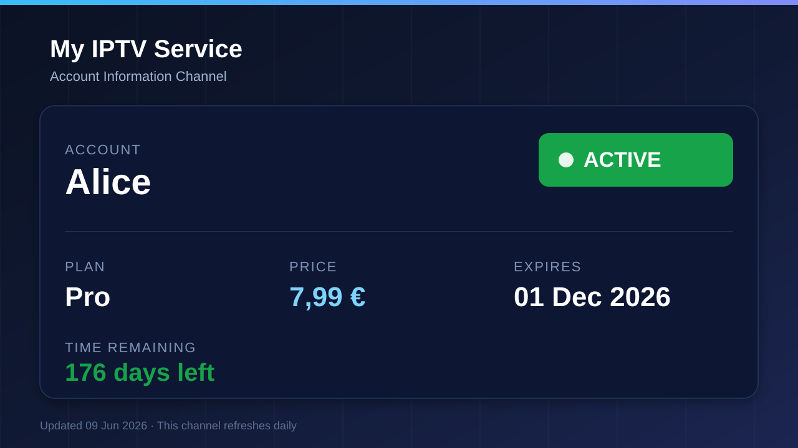

# IPTV Info Channel (m3u playlist info)

A small server that gives each of your customers a personal **looping video
channel** showing their account status — plan, price, expiration date, days
remaining and a colour‑coded status banner — over **background music**,
delivered as a real **HLS stream** that plays in any IPTV player / VLC from an
**.m3u playlist**. Includes a password‑protected **web admin** to manage users,
change expiration dates and edit plan prices, and ships as a **Docker** image.



## Features

- **Multiple users**, each with their own plan, expiration date and private m3u link.
- **Plans** with editable names, prices and feature lists — add or remove plans from the web admin.
- **Expiration** with automatic `ACTIVE` / `EXPIRING SOON` / `EXPIRED` status (threshold configurable).
- **Expired-account offer slide** — expired users see the available plans in an automatic 2-, 3- or 4-column grid, including each plan's features.
- **Looping HLS channel** generated per user with ffmpeg (1920×1080, h264 + AAC).
- **Branding intro animation** — an animated brand slide plays on every channel open, then transitions into the user's account details. Configurable (`INTRO_*`) or disablable.
- **Background music** — includes `assets/music/background.mp3` by default and supports a custom track.
- **Web admin** (`/admin`) — manage users and plans, change expiry, rebuild streams, and copy m3u links.
- **Docker** — one container (Node + ffmpeg), data persisted in a volume.
- **Daily auto‑refresh** so the "days left" counter and status stay accurate.

## Quick start (Docker — recommended)

```bash
# 1. configure
cp .env.example .env
#    then edit .env: set ADMIN_PASSWORD, SESSION_SECRET, and PUBLIC_BASE_URL
#    PUBLIC_BASE_URL must be the address your players use, e.g. http://192.168.1.50:9222

# 2. build + run
docker compose up -d --build

# 3. (optional) create demo users
docker compose exec m3u-info npm run seed

# 4. open the admin panel
#    http://<host>:9222/admin   (log in with ADMIN_PASSWORD)
```

> **PUBLIC_BASE_URL matters.** The generated `.m3u` files embed absolute URLs.
> For LAN IPTV boxes set it to the host machine's IP (not `localhost`), e.g.
> `PUBLIC_BASE_URL=http://192.168.1.50:9222`.

### Without Docker

Requires **Node 20+** and **ffmpeg** on PATH.

```bash
cp .env.example .env      # edit values
npm install
npm run seed              # optional demo users
npm start                 # http://localhost:9222
```

## How customers use it

Each user gets a private link from the admin panel:

```
http://<host>:9222/u/<token>/playlist.m3u
```

Add that URL to any IPTV player (TiviMate, IPTV Smarters, VLC, …) and it plays
the customer's looping info channel. The underlying stream is at
`/hls/<token>/index.m3u8`.

### Programme guide (EPG)

The `.m3u` advertises a per-user **XMLTV** guide (via `url-tvg`), so players that
show an EPG display the current service status right in the channel list and
info bar:

```
http://<host>:9222/u/<token>/epg.xml
```

Each day is one programme whose title is the service status — `✓ Все сервисы
работают`, `⚠ Частичная деградация сервиса`, or `✕ Сбой в работе сервиса` —
driven by the same incidents that power the on-screen status board. The
description also carries the account's subscription status (days left) and any
incident notes. Disable with `EPG_ENABLED=false`.

#### OTT-play FOSS

OTT-play FOSS does not use the raw XMLTV URL for this channel. When
`EPG_FOSS_ENABLED=true` (the default), the playlist also advertises a static
FOSS JSON source:

```m3u
#EXTM3U ... foss-tvg="=infochannel::http://<host>:9222/foss-epg/u/<token>/"
#EXTINF:-1 tvg-id="account-<token>" tvg-source="=infochannel" ...
```

The leading `=` is required in both places. It makes OTT-play fetch
`epg/<xxhash32(tvg-id)>.json` directly from the token-scoped base, bypassing
the central match service. The channel also includes a `tvg-logo` URL so the
player does not make a separate central logo-match request.

The server additionally exposes compatible fallback endpoints at
`/m3u/match-channels` and `/m3u/match-logos`, plus
`/foss-epg/u/<token>/channels.json`.

## Admin panel

`http://<host>:9222/admin` — sign in with `ADMIN_PASSWORD`.

- **Plans & pricing** — add, edit or delete plans and maintain a feature list such as `Sport channels` or `Estonian channels`. Plan changes rebuild affected channel content automatically.
- **Branding** — service name + tagline shown on every channel.
- **Users** — add/edit/delete, change plan, set expiration date, toggle active, copy the m3u link, or generate a fresh link (revokes the old one).

Plans that are assigned to users cannot be deleted until those users are moved
to another plan.

## Background music

The bundled `assets/music/background.mp3` plays by default and is copied into
the Docker image. To use another track, set `MUSIC_FILE` to its path and make
that file available inside the container. Any ffmpeg-readable format works and
is looped to fill the channel. If a configured custom file is missing, the app
falls back to the bundled track.

## Configuration (`.env`)

| Variable | Default | Description |
|---|---|---|
| `PORT` | `9222` | HTTP port. |
| `PUBLIC_BASE_URL` | `http://localhost:9222` | Address embedded in m3u/HLS URLs. Set to host IP on a LAN. |
| `TZ` | `Europe/Tallinn` | Timezone used for logs, daily refresh scheduling and displayed update dates. |
| `ADMIN_PASSWORD` | `changeme` | Admin panel password. **Change it.** |
| `SESSION_SECRET` | — | Signs the admin cookie. Use a long random string. |
| `CHANNEL_DURATION` | `120` | Length (seconds) of the generated loop. Static cards compress tiny. |
| `CHANNEL_WIDTH` / `CHANNEL_HEIGHT` | `1920` / `1080` | Output resolution. |
| `CHANNEL_LIVE_LOOP` | `true` | Serve an endless sliding live playlist with no seekable end. |
| `EXPIRING_THRESHOLD_DAYS` | `7` | Days‑left value at/under which status becomes `EXPIRING SOON`. |
| `EPG_ENABLED` | `true` | Advertise a per‑user XMLTV guide (`/u/<token>/epg.xml`) via `url-tvg`. |
| `EPG_DAYS_AHEAD` / `EPG_DAYS_BEHIND` | `7` / `1` | Calendar days of guide emitted ahead of / behind today. |
| `EPG_FOSS_ENABLED` | `true` | Advertise the token-scoped static OTT-play FOSS JSON guide. |
| `EPG_FOSS_PROVIDER_ID` | `infochannel` | Short source name used by the FOSS playlist attributes. |
| `INTRO_ENABLED` | `true` | Play the animated brand slide before the details card. `false` = plain still card. |
| `INTRO_SLIDE_SECONDS` | `4` | Seconds the brand slide stays on screen before transitioning. |
| `INTRO_TRANSITION` | `slideleft` | ffmpeg `xfade` transition from the brand slide into the card (`fade`, `wipeleft`, `dissolve`, `smoothleft`, …). |
| `MUSIC_FILE` | `assets/music/background.mp3` | Background track. |
| `DATA_DIR` | `data` | Where the database + generated HLS live (the Docker volume). |

## Data & storage

State is kept in a single JSON file at `DATA_DIR/db.json` (users, plans,
settings) and generated streams under `DATA_DIR/hls/<userId>/`. In Docker this
is the mounted `./data` volume, so everything survives restarts and rebuilds.
No external database required.

## Runtime logs

Container output includes concise timestamped details for:

- startup URL and core channel configuration;
- each stream generation start, completion time and failures;
- admin changes that trigger rebuilds;
- scheduler registration and daily refreshes;
- warnings and errors.

Routine HLS segment requests are intentionally not logged. Follow the running
output with:

```bash
docker compose logs -f m3u-info
```

## How it works

1. For each user two 1920×1080 frames are rendered (SVG → PNG via sharp): the
   **brand intro slide** and the **info card**.
2. **ffmpeg** builds the loop: brand slide → (`xfade` transition) → the info
   card held for the rest of `CHANNEL_DURATION`, mixes in the background music,
   and writes reusable **HLS** segments (`index.m3u8` + `.ts` segments). With
   the intro disabled it just loops the still card.
   Rendering happens once per data change, so idle CPU use stays near zero.
3. The server presents those segments as a sliding **live HLS** window with no
   end marker, so IPTV clients keep playing indefinitely. Each `.m3u` load gets
   a tune-in session that starts at the intro before joining the continuous
   loop. It generates a user's stream on first request and switches open clients
   to rebuilt content whenever their data, plan price, or branding changes.
4. A **daily job** (00:05) rebuilds every stream so the day counter and expiry
   status stay current.

## API (admin, cookie‑authenticated)

| Method | Path | Action |
|---|---|---|
| `POST` | `/admin/login` | `{password}` → sets session cookie |
| `GET` | `/admin/api/state` | plans, users (decorated), settings |
| `POST` | `/admin/api/users` | create user |
| `PATCH` | `/admin/api/users/:id` | update username / plan / `expires_at` / active |
| `POST` | `/admin/api/users/:id/token` | regenerate access token |
| `POST` | `/admin/api/users/:id/regenerate` | rebuild this user's stream now |
| `DELETE` | `/admin/api/users/:id` | delete user |
| `POST` | `/admin/api/plans` | Create with `{name, price_eur, features[]}` |
| `PATCH` | `/admin/api/plans/:id` | Update `{name, price_eur, features[]}` |
| `DELETE` | `/admin/api/plans/:id` | Delete an unused plan |
| `PATCH` | `/admin/api/settings` | `{brand_name, tagline}` |
| `POST` | `/admin/api/regenerate-all` | rebuild all streams |

## Notes

- The generated media is reused as an endless live channel, so ffmpeg does not
  need to run continuously. Set `CHANNEL_LIVE_LOOP=false` only to expose the
  finite generated VOD directly.
- Access is by unguessable per‑user token in the URL. Put the server behind
  HTTPS / a reverse proxy if exposing it to the internet.
